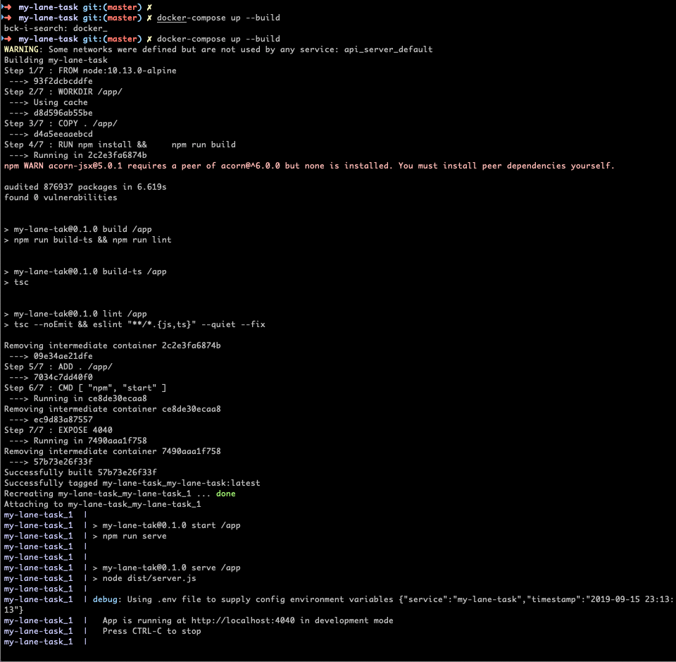

# Example of how to use Node's Child_Process Module`

This shows an example of how to use Node's `child_process` module to serve as workers running on different processes. This application uses an API to send jobs to multiple "workers", waits for the results and then returns the combined result.

# Getting started
- Clone the repository
```
git clone git@github.com:Perry5/my-lane-task.git
```
- Install dependencies
```
cd my-lane-task
npm install
```
- (OPTIONAL) Set environment (vars):
```
cp .env.example .env
```
- Build and run the project
```
npm run build
npm start
```
# HTTP Request
- Base URL for request is: `localhost:4040/info/`
- The query parameter `host` is required. Requests won't succeed without it
- The query parameter `services` is optional. If you don't enter it, it defaults to using 
`["geoip", "ping", "rdap", "reversedns"]` 
- The currently supported services are: 
    - GeoIP
    - Ping
    - RDAP

- Using Curl, Postman or your favorite tool, make a POST request to: 
```
localhost:4040/info/?host=8.8.8.8&services=ping,geoip
```
- Note:
    - `host`: Must be a valid IP address or relative URI (without the "http" or "https")
    - `services`: Is an optional parameter

# HTTP Response
Sample response using Postman (With Google's public IP address)


# Logging
The universal Winston logging library is used for logging.

API Logging


# Docker
You can also standup the application using Docker. 
```$xslt
docker-compose up --build
```
Running with Docker


# Swagger UI
```http://localhost:4040/api-docs```

# Task
### Goal:

Create an application that integrates multiple services into a useful and timesaving workflow.

### Objectives:

Build an application in Typescript that provides an API that takes an IP or domain as input and gathers information from multiple sources returning a single result. Your application must farm individual portions of the lookup to various workers who perform the action. The application should then combine the results and return a single payload.

*The API should accept:*

- IP or domain
- A list of services to query. This input should be optional with a default list used if none provided.

*The API should then:*

- Validate input
- Break the request into multiple individual tasks
- Send those tasks to a pool of 2+ workers. The API must support workers on separate processes/machines/docker containers than the API.
- The workers should then perform the tasks and return the results to the application
- The application should wait for all tasks for a request to be completed, combine the results and return
- Some suggested services available to query:
    - GeoIP
    - RDAP
    - Reverse DNS
    - Ping

### Bonus Points:
- Add additional services (VirusTotal, open ports, website status, domain availability, etc)
- API uses GraphQL
- API has a Swagger Spec (if you use REST)
- Support partial results on error or rate limit

### What we are looking for:
- How you organize your project
- What tooling you use (linting, unit testing) ((bonus points if you use our tslint/prettify rules!))
- Creativity and performance

